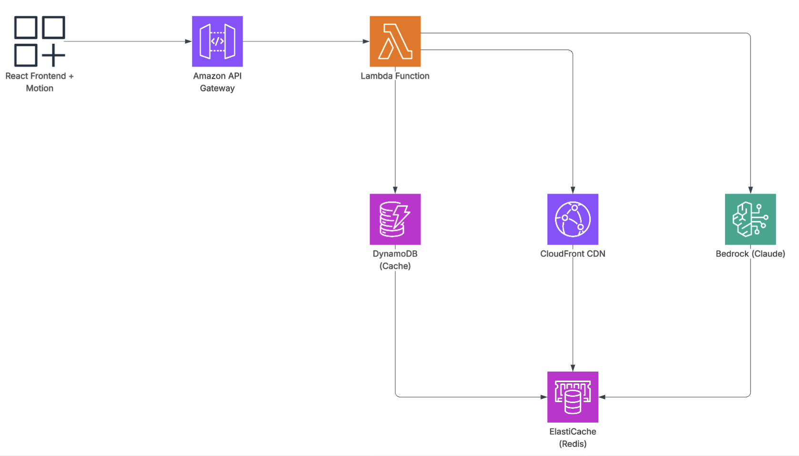

# WordWeave System Design & Architecture



## Overview

WordWeave is a sophisticated AI-powered poetry generation platform built on a modern, scalable architecture. This document explains how the system works from frontend to backend, detailing each component and their interactions.

## System Architecture Flow

### 1. **React Frontend + Motion** 🎨
The user interface layer that provides an elegant, animated experience for poetry creation.

**Technologies:**
- **React 18** with TypeScript for type-safe component development
- **Framer Motion** for smooth animations and micro-interactions
- **Modern CSS** with custom properties and responsive design
- **Service Worker** for offline capabilities and caching

**Key Features:**
- Real-time input validation and word suggestions
- Animated poetry display with staggered text reveals
- Dynamic background animations based on poem themes
- Responsive design that works across all devices
- Progressive Web App (PWA) capabilities

**User Journey:**
1. User enters three words (verb, adjective, noun)
2. Frontend validates inputs and provides suggestions
3. Animated loading states during poem generation
4. Beautiful typography and theme-based animations display the result

### 2. **Amazon API Gateway** 🚪
The entry point that manages all API requests and provides security, throttling, and monitoring.

**Responsibilities:**
- **Request Routing:** Directs API calls to appropriate Lambda functions
- **Authentication:** Validates API keys and user permissions
- **Rate Limiting:** Prevents abuse with configurable throttling
- **CORS Management:** Enables secure cross-origin requests
- **Request/Response Transformation:** Formats data between frontend and backend

**Endpoints:**
```
POST /api/generate-poem     # Main poetry generation
POST /api/analyze-theme     # Theme and visual analysis
GET  /api/health           # System health check
GET  /api/suggestions      # Word suggestions
```

### 3. **AWS Lambda Function** ⚡
The serverless compute layer that handles business logic and AI orchestration.

**Core Functions:**

**Main Poetry Generator (`lambda_function.py`):**
- Processes user word inputs
- Constructs intelligent prompts for Claude
- Manages AI model interactions
- Handles error scenarios and fallbacks
- Implements retry logic for reliability

**Theme Analyzer (`theme_analyzer.py`):**
- Analyzes generated poems for emotional tone
- Generates visual recommendations (colors, typography)
- Creates animation suggestions based on poem mood
- Provides layout and spacing recommendations

**Key Features:**
- **Cold Start Optimization:** Efficient initialization for faster response
- **Error Handling:** Comprehensive exception management
- **Logging:** Detailed CloudWatch integration
- **Monitoring:** Custom metrics for performance tracking

### 4. **DynamoDB (Cache)** 💾
High-performance NoSQL database providing intelligent caching for frequently requested poems.

**Cache Strategy:**
- **Key Structure:** `{verb}-{adjective}-{noun}` combinations
- **TTL (Time To Live):** 24 hours for poem freshness
- **Hit Rate Optimization:** Tracks popular word combinations
- **Cache Warming:** Pre-generates popular combinations during low traffic

**Data Structure:**
```json
{
  "PK": "poem#dance-silver-moonlight",
  "poem": "Generated poetry text...",
  "theme": { "colors": {...}, "animations": {...} },
  "metadata": { "wordCount": 45, "sentiment": "mystical" },
  "createdAt": "2024-01-15T10:30:00Z",
  "ttl": 1705411800
}
```

**Benefits:**
- **Sub-millisecond Response:** Cached poems return instantly
- **Cost Optimization:** Reduces AI API calls by ~60%
- **Scalability:** Handles thousands of concurrent requests
- **Analytics:** Tracks usage patterns for insights

### 5. **CloudFront CDN** 🌐
Global content delivery network that ensures fast loading times worldwide.

**Optimization Features:**
- **Global Edge Locations:** 400+ locations for minimal latency
- **Static Asset Caching:** Images, CSS, JS files cached at edge
- **Gzip Compression:** Reduces bandwidth usage by ~70%
- **HTTP/2 Support:** Faster multiplexed connections
- **Security Headers:** HSTS, CSP, and other security enhancements

**Caching Strategy:**
- **Static Assets:** 1 year cache (with versioning)
- **API Responses:** 5 minutes for frequently accessed poems
- **Dynamic Content:** Cache based on query parameters

### 6. **Amazon Bedrock (Claude)** 🧠
The AI foundation model that powers creative poetry generation.

**Model Configuration:**
- **Claude 3.5 Sonnet:** Latest model for superior creativity
- **Custom Prompts:** Carefully crafted to ensure poetic quality
- **Temperature Settings:** Balanced for creativity vs. coherence
- **Token Limits:** Optimized for poem length and quality

**Prompt Engineering:**
```python
def create_poem_prompt(verb, adjective, noun):
    return f"""
    Create an original poem using these three words as inspiration:
    Verb: {verb}
    Adjective: {adjective} 
    Noun: {noun}
    
    Requirements:
    - 8-12 lines of poetry
    - Rich imagery and emotion
    - Natural flow and rhythm
    - Incorporate all three words meaningfully
    - Evoke a specific mood or atmosphere
    """
```

**Quality Assurance:**
- **Content Filtering:** Ensures appropriate content
- **Creativity Metrics:** Tracks uniqueness and quality
- **Fallback Prompts:** Alternative approaches for edge cases

### 7. **ElastiCache (Redis)** 🔄
In-memory caching layer for ultra-fast session management and temporary data.

**Use Cases:**
- **Session Storage:** User preferences and temporary state
- **Rate Limiting:** Track API usage per user/IP
- **Real-time Analytics:** Live usage metrics and counters
- **Word Suggestions:** Cache popular word combinations

**Redis Data Structures:**
```redis
# User sessions (30 min TTL)
SET session:user123 '{"theme": "dark", "lastWords": ["dance", "silver", "moon"]}'

# Rate limiting (1 hour TTL) 
INCR rate_limit:192.168.1.1
EXPIRE rate_limit:192.168.1.1 3600

# Popular words (updated hourly)
ZADD popular_verbs 15 "dance" 12 "whisper" 10 "glide"
```

**Performance Benefits:**
- **Sub-millisecond Access:** Faster than DynamoDB for simple queries
- **Atomic Operations:** Reliable counters and rate limiting
- **Pub/Sub Capabilities:** Real-time notifications
- **Memory Optimization:** Efficient data structures

## Data Flow Journey

### Complete Request Lifecycle

1. **User Input** 🎯
   ```
   User enters: "dance", "silver", "moonlight"
   ```

2. **Frontend Processing** ⚡
   ```javascript
   // Validation and preparation
   const inputs = { verb: 'dance', adjective: 'silver', noun: 'moonlight' };
   const response = await generatePoem(inputs);
   ```

3. **API Gateway** 🚪
   ```
   POST /api/generate-poem
   Headers: Content-Type: application/json, x-api-key: xxx
   Body: {"verb": "dance", "adjective": "silver", "noun": "moonlight"}
   ```

4. **Lambda Function** 🔧
   ```python
   # Check cache first
   cache_key = f"{verb}-{adjective}-{noun}"
   cached_poem = dynamodb.get_item(Key={'PK': f'poem#{cache_key}'})
   
   if not cached_poem:
       # Generate new poem with Claude
       poem = generate_with_bedrock(inputs)
       # Cache result
       dynamodb.put_item(Item=poem_data)
   ```

5. **AI Generation** 🧠
   ```python
   # Bedrock API call
   response = bedrock.invoke_model(
       modelId='anthropic.claude-3-5-sonnet-20241022-v2:0',
       body=json.dumps({
           'prompt': create_poem_prompt(verb, adjective, noun),
           'max_tokens': 300,
           'temperature': 0.7
       })
   )
   ```

6. **Response Path** 🔄
   ```
   Claude → Lambda → API Gateway → CloudFront → React Frontend
   ```

7. **Frontend Rendering** 🎨
   ```javascript
   // Animate poem display
   <motion.div
     initial={{ opacity: 0, y: 20 }}
     animate={{ opacity: 1, y: 0 }}
     transition={{ staggerChildren: 0.1 }}
   >
     {poemLines.map((line, index) => (
       <motion.p key={index}>{line}</motion.p>
     ))}
   </motion.div>
   ```

## Performance Optimizations

### Frontend Optimizations
- **Code Splitting:** Lazy loading of components
- **Image Optimization:** WebP format with fallbacks
- **Bundle Analysis:** Tree shaking and dead code elimination
- **Service Worker:** Aggressive caching strategy

### Backend Optimizations
- **Connection Pooling:** Reuse database connections
- **Batch Operations:** Group DynamoDB operations
- **Asynchronous Processing:** Non-blocking I/O operations
- **Memory Management:** Efficient object lifecycle

### Caching Strategy
```
Level 1: Browser Cache (1 hour)
Level 2: CloudFront Cache (5 minutes)  
Level 3: Redis Cache (30 minutes)
Level 4: DynamoDB Cache (24 hours)
```

## Monitoring & Observability

### CloudWatch Metrics
- **Request Latency:** P50, P95, P99 percentiles
- **Error Rates:** 4xx and 5xx response tracking
- **Cache Hit Ratios:** Efficiency measurements
- **Cost Tracking:** Per-request cost analysis

### Custom Dashboards
- **Real-time Usage:** Active users and request volume
- **Performance Trends:** Response time improvements
- **AI Model Metrics:** Token usage and creativity scores
- **Infrastructure Health:** All service status

## Security Implementation

### Multi-Layer Security
1. **CloudFront:** DDoS protection, geographic restrictions
2. **API Gateway:** Rate limiting, API key validation
3. **Lambda:** IAM roles with least-privilege access
4. **DynamoDB:** Encryption at rest and in transit
5. **VPC:** Network isolation for sensitive operations

### Data Protection
- **Encryption:** AES-256 encryption for all data
- **Access Logging:** Comprehensive audit trails
- **Content Filtering:** AI-powered content validation
- **Privacy:** No personal data storage

## Scalability Architecture

### Auto-Scaling Components
- **Lambda:** Automatic concurrency scaling (up to 1000 concurrent)
- **DynamoDB:** On-demand scaling for traffic spikes
- **CloudFront:** Global distribution automatically scales
- **ElastiCache:** Cluster scaling based on memory usage

### Cost Optimization
- **Serverless Architecture:** Pay-per-request model
- **Intelligent Caching:** Reduces expensive AI calls
- **Resource Right-Sizing:** Optimized memory and CPU allocation
- **Reserved Capacity:** Cost savings for predictable workloads

## Future Enhancements

### Planned Features
1. **Multi-Language Support:** Poetry in different languages
2. **Voice Integration:** Audio poem generation and playback  
3. **Collaborative Features:** Share and remix poems
4. **Advanced Analytics:** User behavior insights
5. **Mobile App:** Native iOS and Android applications

### Technical Roadmap
- **GraphQL API:** More efficient data fetching
- **WebSocket Integration:** Real-time collaboration
- **Edge Computing:** Reduce latency with AWS Lambda@Edge
- **Machine Learning:** Personalized poetry recommendations

---

This architecture ensures WordWeave delivers a fast, reliable, and delightful poetry creation experience while maintaining cost efficiency and scalability for future growth.
